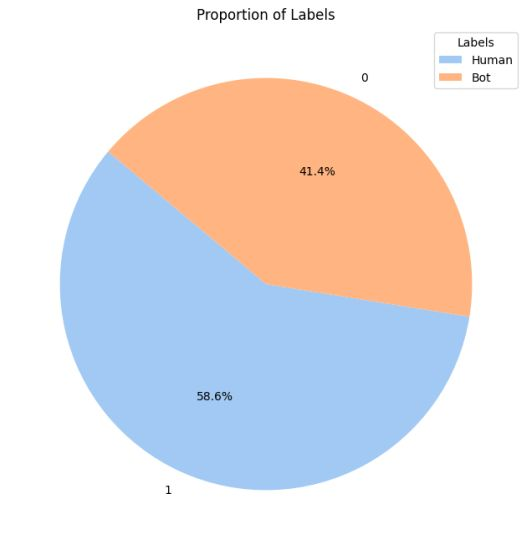
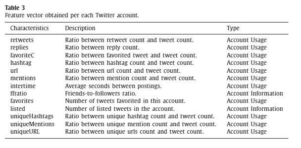
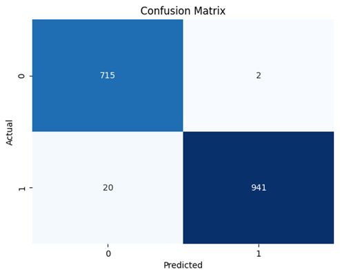
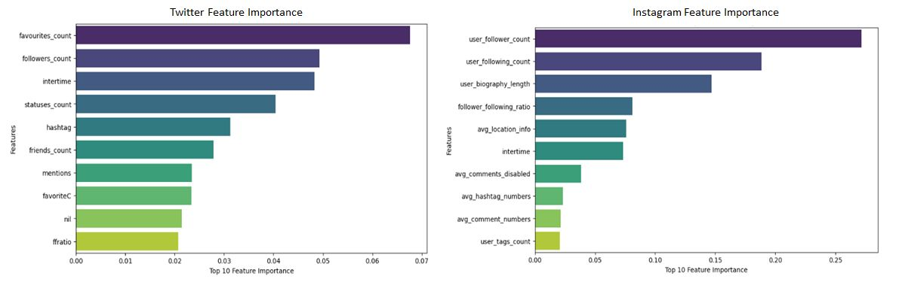

<h1 align="center">Detection of Social Bots using Machine Learning</h1>

Using Random Forest algorithm to detect automated accounts on Twitter and Instagram

<h2>Introduction</h2>

The rise of big data platforms, particularly social media, has brought about new challenges, including bot accounts which are automated profiles managed by software algorithms. While some social bots can be helpful in online social networks, there has been a rise in malevolent social bots that have adverse effects. The dangers they pose lie in their potential to manipulate public opinion, create echo chambers, contribute to the spread of false information, etc.

<h2>Problem Statement</h2>

The object of this project is to develop a machine learning model that can detect social bots on Twitter and Instagram. Several challenges addressed include:

- Identifying the characteristics of social bots on Twitter and Instagram.
- Developing a machine learning model to detect social bots.
- Evaluating the model's performance.
- Identifying the most important features in detecting social bots.
- Discussing the business value of detecting social bots.

<h2>Dataset</h2>

The Twitter dataset used in this project is the <a href="https://botometer.osome.iu.edu/bot-repository/datasets.html">Cresci-2017 </a> dataset, annotated by CrowdFlower contributors. The dataset contains information about genuine, traditional and spambot accounts. Some of the features in the dataset include the number of followers, friends, statuses, tweets, favourites, etc. The popular dataset, instaFake, was used for the Instagram bot detection. The dataset contains information about fake and automated accounts. Some of the features in the dataset include the number of followers, followings, posts, etc. Only the genuine and automated accounts were used in both datasets.

<h2>Methodology</h2>

- 
Data Cleaning: The Cresi17 dataset consists of multiple CSV files of user and tweet information for both genuine and automated accounts. The first step I took was to merge the CSV files into a single dataframe. Then I drop columns with too many missing values.

- 
Text Preprocessing: I combined user tweets with their profile information, unlike most projects which only focus on a single aspect. Accounts with no tweet were designated "Nil". I mean this would make sense rather than drop them. After preprocessing the dataset, the proportion of genuine accounts to automated accounts is given below 
  

- 
Feature Engineering: Lots of credit to <a href="https://github.com/wholenote/twitter-spambot-detection/blob/main/botdetection.ipynb">Wholenote</a> , <a href="https://github.com/divyanshu-vashishth/major-project/blob/main/twitter-code.ipynb">Oyebamiji</a>. I used some sections of his code to extract useful features from the twitter dataset. These features are given below 
 

<h2>Modeling and Interpretation</h2>

- 
The model I used was the Random Forest Classifier. The model achieved 98% accuracy, 99% precision, 97% recall, and 98% F1 score. The confusion matrix is given below      From the confusion matrix, it can be observed that out of 717 actual human-controlled accounts, 715 were correctly classified (True Negatives), and only 2 were misclassified as bot-controlled (False Positives). On the other hand, out of 961 actual bot-controlled accounts, 941 were correctly identified (True Positives), while 20 were misclassified as human-controlled (False Negatives).

- 
Another thing I would like to discuss here is the evaluation metric. In a real-world setting, we would prioritize 'catching' as many bot-controlled accounts as possible, even at the risk of misclassifying some human accounts, because the potential harm from undetected bots is more detrimental. Thus, we choose recall as our main evaluation metric.

- 
Lastly, feature importance.      In terms of the features common to both Twitter and Instagram, it appears that follower count, following count, hashtag, and intertime are significant in both models. This suggests that these features might be universally important in distinguishing between bot-controlled and human-controlled accounts across different social media platforms. Hypothesis please:

    > The significance of hashtags could suggest that bots may employ specific hashtags repetitively, the importance of intertime could also suggest that the time between posts might be a good indicator of bot activity, etc.

<h2>Business Value</h2>

The detection of social bots is crucial for social media platforms to maintain the integrity of their platforms. This project significance lies in 

- 
Protect Platform Integrity: By accurately identifying and removing bot accounts, social media platforms can maintain the authenticity of user interactions and content. This preserves trust in the platform and ensures a genuine user experience.

- 
Mitigate Misinformation Spread: Automated bot detection helps curb the rapid dissemination of false or misleading information, which bots often amplify. This protects users from manipulation and maintains the platform's reputation as a reliable source of information.

- 
Improve User Engagement Metrics: By filtering out bot activity, platforms can present more accurate engagement statistics to users, brands, and stakeholders. This provides a clearer picture of genuine user interaction and content popularity.

- 
Enhance Security and Fraud Prevention: Of course the security aspect. Identifying bot accounts helps platforms better detect and prevent various forms of fraud, including account hijacking, phishing attempts, and coordinated inauthentic behavior.

Note: This readme focused majorly on Twitter modeling. The Instagram dataset is quite similar although there are no texts and it is quite cleaned up already. The same feature engineering applies. You can find all the information you need in the <a href="https://github.com/divyanshu-vashishth/major-project/blob/main/instagram-code.ipynb">notebook</a>.

<h2>Citations</h2>

>- 
Cresci, S., Di Pietro, R., Petrocchi, M., Spognardi, A., & Tesconi, M. (2017, April). The paradigm-shift of social spambots: Evidence, theories, and tools for the arms race. In Proceedings of the 26th International Conference on World Wide Web Companion (pp. 963-972). ACM. [pdf]

>- 
Cresci, S., Di Pietro, R., Petrocchi, M., Spognardi, A., & Tesconi, M. (2017). Social Fingerprinting: detection of spambot groups through DNA-inspired behavioral modeling. IEEE Transactions on Dependable and Secure Computing. [pdf]

